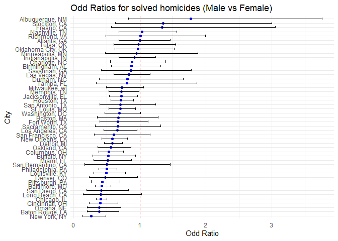
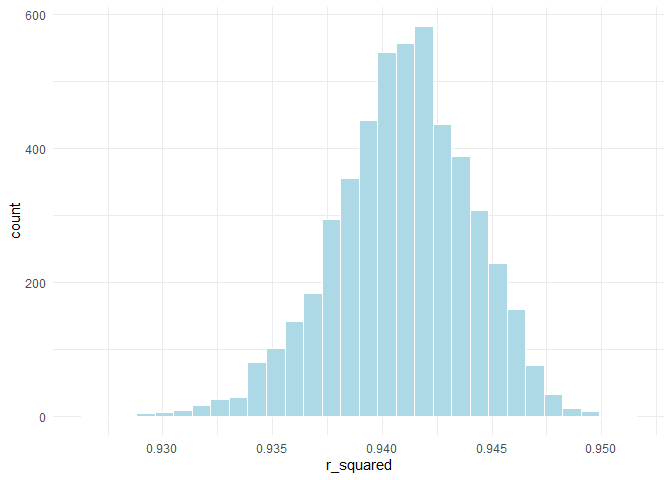
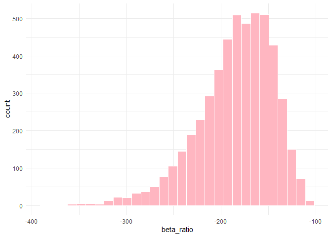

p8105_hw6_nnk
================

## Problem 1

**import dataset**

``` r
homicide_df= 
  read_csv("./data/homicide-data.csv") |>
  janitor::clean_names()
```

**cleaning the data**

``` r
homicide_df = 
  homicide_df |>
   mutate(
  city_state = str_c(city, state, sep = ", "),
  resolved  = if_else(disposition == "Closed by arrest", 1, 0),
  victim_age = as.numeric(victim_age)
  ) |> 
  
  filter(
    !city_state %in% c("Dallas, TX", "Phoenix, AZ", 
                       "Kansas City, MO", "Tulsa, AL"),
    victim_race %in% c("White", "Black")
  ) |> 
  drop_na(victim_age, victim_sex, victim_race)
```

**GLM regression**

``` r
baltimore_df = 
  homicide_df |> 
  filter(city_state == "Baltimore, MD")

baltimore_fit = 
  baltimore_df |> 
  glm(
    resolved ~ victim_age + victim_sex + victim_race,
    data   = _,
    family = binomial()
  )

baltimore_or = 
  baltimore_fit |> 
  tidy(conf.int = TRUE, exponentiate = TRUE) |> 
  filter(term == "victim_sexMale") |> 
  mutate(term = "Male vs Female (ref)") |> 
  select(term, estimate, conf.low, conf.high)

baltimore_or |> 
  knitr::kable(
    col.names = c(
      "Male vs Female", "Odd ratio", "Lower 95%CI", "Upper 95% CI"
    ),
    digits = 3)
```

| Male vs Female       | Odd ratio | Lower 95%CI | Upper 95% CI |
|:---------------------|----------:|------------:|-------------:|
| Male vs Female (ref) |     0.426 |       0.324 |        0.558 |

**GLM regression for all cities**

``` r
city_glm_df = 
  homicide_df |>
  nest(data = - city_state)|>
  mutate(
    models = map(data,
                  ~ glm(resolved ~ victim_age + victim_sex + victim_race,
            data = ., family = binomial())
    ),
    tidy_res = map(
      models,
      ~ tidy(., conf.int = TRUE, exponentiate = TRUE)
    )
  ) |> 
  select(city_state, tidy_res) |> 
  unnest(tidy_res) |> 
  filter(term == "victim_sexMale") 
```

    ## Warning: There were 43 warnings in `mutate()`.
    ## The first warning was:
    ## ℹ In argument: `tidy_res = map(models, ~tidy(., conf.int = TRUE, exponentiate =
    ##   TRUE))`.
    ## Caused by warning:
    ## ! glm.fit: fitted probabilities numerically 0 or 1 occurred
    ## ℹ Run `dplyr::last_dplyr_warnings()` to see the 42 remaining warnings.

``` r
city_glm_df |>
   arrange(estimate) |> 
  select(city_state, estimate, conf.low, conf.high) |> 
  mutate(
    estimate       = round(estimate, 3),
    conf.low = round(conf.low, 3),
    conf.high = round(conf.high, 3)
  ) |> 
  knitr::kable(
    col.names = c(
      "City",
      "Adjusted OR (Male vs Female)",
      "Lower 95% CI",
      "Upper 95% CI"
    )
  )
```

| City               | Adjusted OR (Male vs Female) | Lower 95% CI | Upper 95% CI |
|:-------------------|-----------------------------:|-------------:|-------------:|
| New York, NY       |                        0.262 |        0.133 |        0.485 |
| Baton Rouge, LA    |                        0.381 |        0.204 |        0.684 |
| Omaha, NE          |                        0.382 |        0.199 |        0.711 |
| Cincinnati, OH     |                        0.400 |        0.231 |        0.667 |
| Chicago, IL        |                        0.410 |        0.336 |        0.501 |
| Long Beach, CA     |                        0.410 |        0.143 |        1.024 |
| San Diego, CA      |                        0.413 |        0.191 |        0.830 |
| Baltimore, MD      |                        0.426 |        0.324 |        0.558 |
| Pittsburgh, PA     |                        0.431 |        0.263 |        0.696 |
| Denver, CO         |                        0.479 |        0.233 |        0.962 |
| Louisville, KY     |                        0.491 |        0.301 |        0.784 |
| Philadelphia, PA   |                        0.496 |        0.376 |        0.650 |
| San Bernardino, CA |                        0.500 |        0.166 |        1.462 |
| Miami, FL          |                        0.515 |        0.304 |        0.873 |
| Buffalo, NY        |                        0.521 |        0.288 |        0.936 |
| Columbus, OH       |                        0.532 |        0.377 |        0.748 |
| Oakland, CA        |                        0.563 |        0.364 |        0.867 |
| Detroit, MI        |                        0.582 |        0.462 |        0.734 |
| New Orleans, LA    |                        0.585 |        0.422 |        0.812 |
| San Francisco, CA  |                        0.608 |        0.312 |        1.155 |
| Los Angeles, CA    |                        0.662 |        0.457 |        0.954 |
| Sacramento, CA     |                        0.669 |        0.326 |        1.314 |
| Fort Worth, TX     |                        0.669 |        0.394 |        1.121 |
| Boston, MA         |                        0.674 |        0.353 |        1.277 |
| Washington, DC     |                        0.690 |        0.465 |        1.012 |
| St. Louis, MO      |                        0.703 |        0.530 |        0.932 |
| San Antonio, TX    |                        0.705 |        0.393 |        1.238 |
| Houston, TX        |                        0.711 |        0.557 |        0.906 |
| Jacksonville, FL   |                        0.720 |        0.536 |        0.965 |
| Memphis, TN        |                        0.723 |        0.526 |        0.984 |
| Milwaukee, wI      |                        0.727 |        0.495 |        1.054 |
| Tampa, FL          |                        0.808 |        0.340 |        1.860 |
| Durham, NC         |                        0.812 |        0.382 |        1.658 |
| Las Vegas, NV      |                        0.837 |        0.606 |        1.151 |
| Savannah, GA       |                        0.867 |        0.419 |        1.780 |
| Birmingham, AL     |                        0.870 |        0.571 |        1.314 |
| Charlotte, NC      |                        0.884 |        0.551 |        1.391 |
| Indianapolis, IN   |                        0.919 |        0.678 |        1.241 |
| Minneapolis, MN    |                        0.947 |        0.476 |        1.881 |
| Oklahoma City, OK  |                        0.974 |        0.623 |        1.520 |
| Tulsa, OK          |                        0.976 |        0.609 |        1.544 |
| Atlanta, GA        |                        1.000 |        0.680 |        1.458 |
| Richmond, VA       |                        1.006 |        0.483 |        1.994 |
| Nashville, TN      |                        1.034 |        0.681 |        1.556 |
| Fresno, CA         |                        1.335 |        0.567 |        3.048 |
| Stockton, CA       |                        1.352 |        0.626 |        2.994 |
| Albuquerque, NM    |                        1.767 |        0.825 |        3.762 |

Create a plot to show the estimated OR and 95%CI

``` r
city_glm_df |>
  mutate(city_state = fct_reorder(city_state, estimate)) |>
  ggplot(aes(x = city_state, y = estimate)) +
  geom_point(color = "blue")+
  geom_errorbar(aes(ymin = conf.low, ymax = conf.high), width = 0.5) +
  geom_hline(yintercept = 1, linetype = "dashed", color = "red") +
  coord_flip() +
  labs(
    title = "Adjusted ORs for solving homicides (Male vs Female)",
    x = "City",
    y = "Adjusted OR"
  ) +
  theme_minimal()
```

<!-- -->

## Problem 2

**import data**

``` r
data("weather_df")
set.seed(11)
```

We’ll focus on a simple linear regression with `tmax` as the response
with `tmin` and `prcp` as the predictors, and are interested in the
distribution of two quantities estimated from these data:

- Estimated R-squared
- Ratio of estimated beta_1/beta_2 (β1/β2)

**cleaning the data**

``` r
weather_df1 = weather_df |>
  drop_na(prcp, tmax, tmin)
```

checking a simple linear fit

``` r
 fit = lm(tmax ~ tmin+ prcp, data = weather_df1)
summary(fit)
```

    ## 
    ## Call:
    ## lm(formula = tmax ~ tmin + prcp, data = weather_df1)
    ## 
    ## Residuals:
    ##     Min      1Q  Median      3Q     Max 
    ## -6.5357 -2.0070 -0.3252  1.8643 22.6490 
    ## 
    ## Coefficients:
    ##               Estimate Std. Error t value Pr(>|t|)    
    ## (Intercept)  7.7756380  0.0854060  91.043   <2e-16 ***
    ## tmin         1.0174796  0.0055814 182.299   <2e-16 ***
    ## prcp        -0.0055783  0.0005927  -9.411   <2e-16 ***
    ## ---
    ## Signif. codes:  0 '***' 0.001 '**' 0.01 '*' 0.05 '.' 0.1 ' ' 1
    ## 
    ## Residual standard error: 2.73 on 2168 degrees of freedom
    ## Multiple R-squared:  0.9409, Adjusted R-squared:  0.9408 
    ## F-statistic: 1.724e+04 on 2 and 2168 DF,  p-value: < 2.2e-16

bootstrapping function

``` r
boot_function = function(df) {
  boot_df = df |> 
    sample_frac(size = 1, replace = TRUE)
  fit = lm(tmax ~ tmin + prcp, data = boot_df)
  r_squared = broom::glance(fit) |> 
    pull(r.squared)
  beta_1 = broom::tidy(fit) |> 
    filter(term == "tmin") |> 
    pull(estimate) 
  beta_2 = broom::tidy(fit) |> 
    filter(term == "prcp") |> 
    pull(estimate) 
  beta_ratio = beta_1/beta_2
  
  tibble(r_squared = r_squared, beta_ratio = beta_ratio)
}
```

Testing function

``` r
boot_function(weather_df1)
```

    ## # A tibble: 1 × 2
    ##   r_squared beta_ratio
    ##       <dbl>      <dbl>
    ## 1     0.947      -182.

Create 5,000 bootstrap samples and fit the model in each sample

``` r
weather_sample = 
  tibble(
    iter = 1:5000
  ) |> 
  mutate(
    sample = map(iter, \(i) boot_function(df = weather_df1))
  ) |> 
  unnest(sample)
```

Plot the distributions

``` r
weather_sample |> 
  ggplot(aes(x = r_squared)) +
  geom_histogram(bins = 30, fill = "lightblue", color = "white")
```

<!-- -->

``` r
weather_sample |> 
  ggplot(aes(x = beta_ratio)) +
  geom_histogram(bins = 30, fill = "lightpink", color = "white") 
```

<!-- -->

identify 2.5% and 97.5% quantiles to find 95% confidence intervals for
r_squared

``` r
weather_sample |> 
  summarize(
    r_squared_lower_ci = quantile(r_squared, 0.025),
    r_squared_upper_ci = quantile(r_squared, 0.975),
    beta_ratio_lower = quantile(beta_ratio, 0.025),
    beta_ratio_upper = quantile(beta_ratio, 0.975)
  ) |> 
  knitr::kable(digits = 3)
```

| r_squared_lower_ci | r_squared_upper_ci | beta_ratio_lower | beta_ratio_upper |
|-------------------:|-------------------:|-----------------:|-----------------:|
|              0.934 |              0.947 |         -277.794 |         -124.377 |

**Comment** The 95% CI of R-squared are 0.934-0.946 which means the
model is consistently explaining more thatn 93% of the variation of
`tmax`. The 95% CI of the ratio of β1/β2 are -277.04, -125.02 which
means that `tmin` showed strong possitive association with `tmax` while
`prcp` has a weak negative association with `tmax`.
