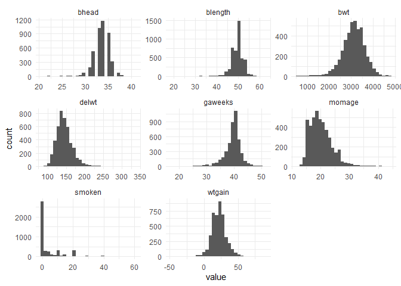
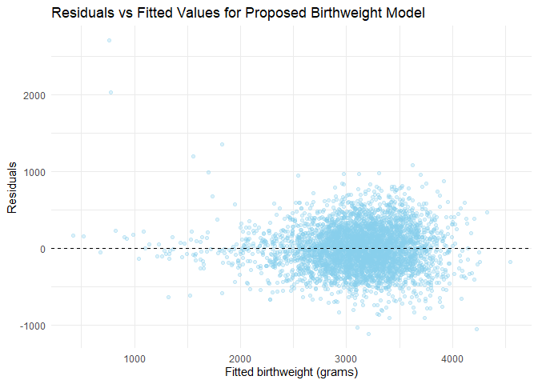

p8105_hw6_nnk
================

## Problem 1

**import dataset**

``` r
homicide_df= 
  read_csv("./data/homicide-data.csv") |>
  janitor::clean_names()
```

**cleaning the data**

``` r
homicide_df = 
  homicide_df |>
   mutate(
  city_state = str_c(city, state, sep = ", "),
  resolved  = if_else(disposition == "Closed by arrest", 1, 0),
  victim_age = as.numeric(victim_age)
  ) |> 
  
  filter(
    !city_state %in% c("Dallas, TX", "Phoenix, AZ", 
                       "Kansas City, MO", "Tulsa, AL"),
    victim_race %in% c("White", "Black")
  ) |> 
  drop_na(victim_age, victim_sex, victim_race)
```

**GLM regression**

``` r
baltimore_df = 
  homicide_df |> 
  filter(city_state == "Baltimore, MD")

baltimore_fit = 
  baltimore_df |> 
  glm(
    resolved ~ victim_age + victim_sex + victim_race,
    data   = _,
    family = binomial()
  )

baltimore_or = 
  baltimore_fit |> 
  tidy(conf.int = TRUE, exponentiate = TRUE) |> 
  filter(term == "victim_sexMale") |> 
  mutate(term = "Male vs Female (ref)") |> 
  select(term, estimate, conf.low, conf.high)

baltimore_or |> 
  knitr::kable(
    col.names = c(
      "Male vs Female", "Odd ratio", "Lower 95%CI", "Upper 95% CI"
    ),
    digits = 3)
```

| Male vs Female       | Odd ratio | Lower 95%CI | Upper 95% CI |
|:---------------------|----------:|------------:|-------------:|
| Male vs Female (ref) |     0.426 |       0.324 |        0.558 |

**GLM regression for all cities**

``` r
city_glm_df = 
  homicide_df |>
  nest(data = - city_state)|>
  mutate(
    models = map(data,~ glm(resolved ~ victim_age + victim_sex + victim_race,
            data = ., family = binomial())),
    tidy_res = map(models,~ tidy(., conf.int = TRUE, exponentiate = TRUE))
  ) |> 
  select(city_state, tidy_res) |> 
  unnest(tidy_res) |> 
  filter(term == "victim_sexMale") 
```

    ## Warning: There were 43 warnings in `mutate()`.
    ## The first warning was:
    ## ℹ In argument: `tidy_res = map(models, ~tidy(., conf.int = TRUE, exponentiate =
    ##   TRUE))`.
    ## Caused by warning:
    ## ! glm.fit: fitted probabilities numerically 0 or 1 occurred
    ## ℹ Run `dplyr::last_dplyr_warnings()` to see the 42 remaining warnings.

``` r
city_glm_df |>
   arrange(estimate) |> 
  select(city_state, estimate, conf.low, conf.high) |> 
  mutate(
    estimate       = round(estimate, 3),
    conf.low = round(conf.low, 3),
    conf.high = round(conf.high, 3)
  ) |> 
  knitr::kable(
    col.names = c(
      "City",
      "OR (Male vs Female)",
      "Lower 95% CI",
      "Upper 95% CI"
    )
  )
```

| City               | OR (Male vs Female) | Lower 95% CI | Upper 95% CI |
|:-------------------|--------------------:|-------------:|-------------:|
| New York, NY       |               0.262 |        0.133 |        0.485 |
| Baton Rouge, LA    |               0.381 |        0.204 |        0.684 |
| Omaha, NE          |               0.382 |        0.199 |        0.711 |
| Cincinnati, OH     |               0.400 |        0.231 |        0.667 |
| Chicago, IL        |               0.410 |        0.336 |        0.501 |
| Long Beach, CA     |               0.410 |        0.143 |        1.024 |
| San Diego, CA      |               0.413 |        0.191 |        0.830 |
| Baltimore, MD      |               0.426 |        0.324 |        0.558 |
| Pittsburgh, PA     |               0.431 |        0.263 |        0.696 |
| Denver, CO         |               0.479 |        0.233 |        0.962 |
| Louisville, KY     |               0.491 |        0.301 |        0.784 |
| Philadelphia, PA   |               0.496 |        0.376 |        0.650 |
| San Bernardino, CA |               0.500 |        0.166 |        1.462 |
| Miami, FL          |               0.515 |        0.304 |        0.873 |
| Buffalo, NY        |               0.521 |        0.288 |        0.936 |
| Columbus, OH       |               0.532 |        0.377 |        0.748 |
| Oakland, CA        |               0.563 |        0.364 |        0.867 |
| Detroit, MI        |               0.582 |        0.462 |        0.734 |
| New Orleans, LA    |               0.585 |        0.422 |        0.812 |
| San Francisco, CA  |               0.608 |        0.312 |        1.155 |
| Los Angeles, CA    |               0.662 |        0.457 |        0.954 |
| Sacramento, CA     |               0.669 |        0.326 |        1.314 |
| Fort Worth, TX     |               0.669 |        0.394 |        1.121 |
| Boston, MA         |               0.674 |        0.353 |        1.277 |
| Washington, DC     |               0.690 |        0.465 |        1.012 |
| St. Louis, MO      |               0.703 |        0.530 |        0.932 |
| San Antonio, TX    |               0.705 |        0.393 |        1.238 |
| Houston, TX        |               0.711 |        0.557 |        0.906 |
| Jacksonville, FL   |               0.720 |        0.536 |        0.965 |
| Memphis, TN        |               0.723 |        0.526 |        0.984 |
| Milwaukee, wI      |               0.727 |        0.495 |        1.054 |
| Tampa, FL          |               0.808 |        0.340 |        1.860 |
| Durham, NC         |               0.812 |        0.382 |        1.658 |
| Las Vegas, NV      |               0.837 |        0.606 |        1.151 |
| Savannah, GA       |               0.867 |        0.419 |        1.780 |
| Birmingham, AL     |               0.870 |        0.571 |        1.314 |
| Charlotte, NC      |               0.884 |        0.551 |        1.391 |
| Indianapolis, IN   |               0.919 |        0.678 |        1.241 |
| Minneapolis, MN    |               0.947 |        0.476 |        1.881 |
| Oklahoma City, OK  |               0.974 |        0.623 |        1.520 |
| Tulsa, OK          |               0.976 |        0.609 |        1.544 |
| Atlanta, GA        |               1.000 |        0.680 |        1.458 |
| Richmond, VA       |               1.006 |        0.483 |        1.994 |
| Nashville, TN      |               1.034 |        0.681 |        1.556 |
| Fresno, CA         |               1.335 |        0.567 |        3.048 |
| Stockton, CA       |               1.352 |        0.626 |        2.994 |
| Albuquerque, NM    |               1.767 |        0.825 |        3.762 |

Create a plot to show the estimated OR and 95%CI

``` r
city_glm_df |>
  mutate(city_state = fct_reorder(city_state, estimate)) |>
  ggplot(aes(x = city_state, y = estimate)) +
  geom_point(color = "blue")+
  geom_errorbar(aes(ymin = conf.low, ymax = conf.high), width = 0.5) +
  geom_hline(yintercept = 1, linetype = "dashed", color = "red") +
  coord_flip() +
  labs(
    title = "Odd Ratios for solved homicides (Male vs Female)",
    x = "City",
    y = "Odd Ratio"
  ) +
  theme_minimal()
```

<!-- -->

**comment** The Odd ratios of solving crime for male vs female varied
across cities ranged from lowest in NY (0.26, 95% CI : 0.133-0.485) to
highest in Albuquerque (1.767, 95% CI : 0.825, 3.762). Most cities have
OR \<1 which indicated the crimes involving female victims were likely
to be solved more than the ones with male victims. The 95% CI of these
ORs were not including 1 so the differences by victim sex in relation to
crime solving status are statistically significant. Only six ities with
ORs \> 1 which means at these cities the crimes were more likely in the
solved category for male victims compared to female victim cases.
However cities with the ORs higher than 1 also have the 95% CI of the
odd ratios included 1 which means there is no statistically significant
difference between victim sex (male vs female) in correlation with crime
solving status.

## Problem 2

**import data**

``` r
data("weather_df")
set.seed(11)
```

We’ll focus on a simple linear regression with `tmax` as the response
with `tmin` and `prcp` as the predictors, and are interested in the
distribution of two quantities estimated from these data:

- Estimated R-squared
- Ratio of estimated beta_1/beta_2 (β1/β2)

**cleaning the data**

``` r
weather_df1 = weather_df |>
  drop_na(prcp, tmax, tmin)
```

checking a simple linear fit

``` r
 fit = lm(tmax ~ tmin+ prcp, data = weather_df1)
summary(fit)
```

    ## 
    ## Call:
    ## lm(formula = tmax ~ tmin + prcp, data = weather_df1)
    ## 
    ## Residuals:
    ##     Min      1Q  Median      3Q     Max 
    ## -6.5357 -2.0070 -0.3252  1.8643 22.6490 
    ## 
    ## Coefficients:
    ##               Estimate Std. Error t value Pr(>|t|)    
    ## (Intercept)  7.7756380  0.0854060  91.043   <2e-16 ***
    ## tmin         1.0174796  0.0055814 182.299   <2e-16 ***
    ## prcp        -0.0055783  0.0005927  -9.411   <2e-16 ***
    ## ---
    ## Signif. codes:  0 '***' 0.001 '**' 0.01 '*' 0.05 '.' 0.1 ' ' 1
    ## 
    ## Residual standard error: 2.73 on 2168 degrees of freedom
    ## Multiple R-squared:  0.9409, Adjusted R-squared:  0.9408 
    ## F-statistic: 1.724e+04 on 2 and 2168 DF,  p-value: < 2.2e-16

bootstrapping function

``` r
boot_function = function(df) {
  boot_df = df |> 
    sample_frac(size = 1, replace = TRUE)
  fit = lm(tmax ~ tmin + prcp, data = boot_df)
  r_squared = broom::glance(fit) |> 
    pull(r.squared)
  beta_1 = broom::tidy(fit) |> 
    filter(term == "tmin") |> 
    pull(estimate) 
  beta_2 = broom::tidy(fit) |> 
    filter(term == "prcp") |> 
    pull(estimate) 
  beta_ratio = beta_1/beta_2
  
  tibble(r_squared = r_squared, beta_ratio = beta_ratio)
}
```

Testing function

``` r
boot_function(weather_df1)
```

    ## # A tibble: 1 × 2
    ##   r_squared beta_ratio
    ##       <dbl>      <dbl>
    ## 1     0.947      -182.

Create 5,000 bootstrap samples and fit the model in each sample

``` r
weather_sample = 
  tibble(
    iter = 1:5000
  ) |> 
  mutate(
    sample = map(iter, \(i) boot_function(df = weather_df1))
  ) |> 
  unnest(sample)
```

Plot the distributions

``` r
weather_sample |> 
  ggplot(aes(x = r_squared)) +
  geom_histogram(bins = 30, fill = "lightblue", color = "white")
```

<!-- -->

``` r
weather_sample |> 
  ggplot(aes(x = beta_ratio)) +
  geom_histogram(bins = 30, fill = "lightpink", color = "white") 
```

<!-- -->

identify 2.5% and 97.5% quantiles to find 95% confidence intervals for
r_squared

``` r
weather_sample |> 
  summarize(
    r_squared_lower_ci = quantile(r_squared, 0.025),
    r_squared_upper_ci = quantile(r_squared, 0.975),
    beta_ratio_lower = quantile(beta_ratio, 0.025),
    beta_ratio_upper = quantile(beta_ratio, 0.975)
  ) |> 
  knitr::kable(digits = 3)
```

| r_squared_lower_ci | r_squared_upper_ci | beta_ratio_lower | beta_ratio_upper |
|-------------------:|-------------------:|-----------------:|-----------------:|
|              0.934 |              0.947 |         -277.794 |         -124.377 |

**Comment** The 95% CI of R-squared are 0.934-0.946 which means the
model is consistently explaining more thatn 93% of the variation of
`tmax`. The 95% CI of the ratio of β1/β2 are -277.04, -125.02 which
means that `tmin` showed strong possitive association with `tmax` while
`prcp` has a weak negative association with `tmax`.

## Problem 3

Load and clean the data for regression analysis (i.e. use appropriate
variable names, convert numeric to factor where appropriate, check for
the presence of missing data, etc.).

**immport the data**

``` r
bw_df = read_csv("./data/birthweight.csv") |> 
  janitor::clean_names()
```

    ## Rows: 4342 Columns: 20
    ## ── Column specification ────────────────────────────────────────────────────────
    ## Delimiter: ","
    ## dbl (20): babysex, bhead, blength, bwt, delwt, fincome, frace, gaweeks, malf...
    ## 
    ## ℹ Use `spec()` to retrieve the full column specification for this data.
    ## ℹ Specify the column types or set `show_col_types = FALSE` to quiet this message.

``` r
bw_df |> glimpse()
```

    ## Rows: 4,342
    ## Columns: 20
    ## $ babysex  <dbl> 2, 1, 2, 1, 2, 1, 2, 2, 1, 1, 2, 1, 2, 1, 1, 2, 1, 2, 2, 2, 1…
    ## $ bhead    <dbl> 34, 34, 36, 34, 34, 33, 33, 33, 36, 33, 35, 35, 35, 36, 35, 3…
    ## $ blength  <dbl> 51, 48, 50, 52, 52, 52, 46, 49, 52, 50, 51, 51, 48, 53, 51, 4…
    ## $ bwt      <dbl> 3629, 3062, 3345, 3062, 3374, 3374, 2523, 2778, 3515, 3459, 3…
    ## $ delwt    <dbl> 177, 156, 148, 157, 156, 129, 126, 140, 146, 169, 130, 146, 1…
    ## $ fincome  <dbl> 35, 65, 85, 55, 5, 55, 96, 5, 85, 75, 55, 55, 75, 75, 65, 75,…
    ## $ frace    <dbl> 1, 2, 1, 1, 1, 1, 2, 1, 1, 2, 1, 1, 1, 1, 1, 2, 1, 1, 1, 2, 1…
    ## $ gaweeks  <dbl> 39.9, 25.9, 39.9, 40.0, 41.6, 40.7, 40.3, 37.4, 40.3, 40.7, 4…
    ## $ malform  <dbl> 0, 0, 0, 0, 0, 0, 0, 0, 0, 0, 0, 0, 0, 0, 0, 0, 0, 0, 0, 0, 0…
    ## $ menarche <dbl> 13, 14, 12, 14, 13, 12, 14, 12, 11, 12, 13, 12, 13, 11, 12, 1…
    ## $ mheight  <dbl> 63, 65, 64, 64, 66, 66, 72, 62, 61, 64, 67, 62, 64, 68, 62, 6…
    ## $ momage   <dbl> 36, 25, 29, 18, 20, 23, 29, 19, 13, 19, 23, 16, 28, 23, 21, 1…
    ## $ mrace    <dbl> 1, 2, 1, 1, 1, 1, 2, 1, 1, 2, 1, 1, 1, 1, 1, 2, 1, 1, 1, 2, 1…
    ## $ parity   <dbl> 3, 0, 0, 0, 0, 0, 0, 0, 0, 0, 0, 0, 0, 0, 0, 0, 0, 0, 0, 0, 0…
    ## $ pnumlbw  <dbl> 0, 0, 0, 0, 0, 0, 0, 0, 0, 0, 0, 0, 0, 0, 0, 0, 0, 0, 0, 0, 0…
    ## $ pnumsga  <dbl> 0, 0, 0, 0, 0, 0, 0, 0, 0, 0, 0, 0, 0, 0, 0, 0, 0, 0, 0, 0, 0…
    ## $ ppbmi    <dbl> 26.27184, 21.34485, 23.56517, 21.84508, 21.02642, 18.60030, 1…
    ## $ ppwt     <dbl> 148, 128, 137, 127, 130, 115, 105, 119, 105, 145, 110, 115, 1…
    ## $ smoken   <dbl> 0.000, 0.000, 1.000, 10.000, 1.000, 0.000, 0.000, 0.000, 0.00…
    ## $ wtgain   <dbl> 29, 28, 11, 30, 26, 14, 21, 21, 41, 24, 20, 31, 23, 21, 24, 2…

Propose a regression model for birthweight. This model may be based on a
hypothesized structure for the factors that underly birthweight, on a
data-driven model-building process, or a combination of the two.
Describe your modeling process and show a plot of model residuals
against fitted values – use add_predictions and add_residuals in making
this plot.

``` r
bw_df =
  bw_df |>
  mutate(
    babysex = factor(babysex, labels = c("male", "female")),
    malform = factor(malform, labels = c("absent", "present")),
    mrace   = factor(mrace),
    frace   = factor(frace)
  )
bw_df |> 
  select(bwt, bhead, blength, gaweeks, momage, delwt, smoken, wtgain) |> 
  pivot_longer(everything()) |> 
  ggplot(aes(value)) + 
  geom_histogram(bins = 30) +
  facet_wrap(~ name, scales = "free")
```

<!-- -->

my model included: `babysex`, `bhead`, `blength`, `gaweeks`, `momage`,
`smoken`, `wtgain` where I also explored the interaction between
`gaweeks` and `bhead` and `blength`.

``` r
mod_1 = bw_df |>
  lm(
    bwt ~ babysex + bhead*blength*gaweeks + momage + smoken + wtgain,
    data = _
  )

mod_1 |> tidy()
```

    ## # A tibble: 12 × 5
    ##    term                   estimate std.error statistic  p.value
    ##    <chr>                     <dbl>     <dbl>     <dbl>    <dbl>
    ##  1 (Intercept)           14874.    4559.          3.26 1.11e- 3
    ##  2 babysexfemale            36.1      8.72        4.14 3.61e- 5
    ##  3 bhead                  -542.     147.         -3.67 2.41e- 4
    ##  4 blength                -411.     105.         -3.92 8.83e- 5
    ##  5 gaweeks                -456.     134.         -3.41 6.51e- 4
    ##  6 momage                    7.42     1.12        6.62 4.07e-11
    ##  7 smoken                   -2.18     0.581      -3.75 1.78e- 4
    ##  8 wtgain                    3.81     0.402       9.49 3.80e-21
    ##  9 bhead:blength            15.6      3.20        4.88 1.11e- 6
    ## 10 bhead:gaweeks            15.2      4.19        3.63 2.92e- 4
    ## 11 blength:gaweeks          11.1      2.93        3.77 1.66e- 4
    ## 12 bhead:blength:gaweeks    -0.354    0.0884     -4.00 6.37e- 5

``` r
bw_df_add = bw_df |>
  add_predictions(mod_1) |>
  add_residuals(mod_1)


bw_df_add |>
  ggplot(aes(x = pred, y = resid)) +
  geom_point(alpha = 0.3, color = "skyblue") +
  geom_hline(yintercept = 0, linetype = "dashed") +
  labs(
    title = "Residuals vs Fitted Values for Proposed Birthweight Model",
    x = "Fitted birthweight (grams)",
    y = "Residuals"
  ) +
  theme_minimal()
```

<!-- -->

**Compare your model to two others**

``` r
#main effect only
mod_2 = bw_df |>
  lm(bwt ~ + blength + gaweeks, data =_)
mod_2 |> tidy()
```

    ## # A tibble: 3 × 5
    ##   term        estimate std.error statistic  p.value
    ##   <chr>          <dbl>     <dbl>     <dbl>    <dbl>
    ## 1 (Intercept)  -4348.      98.0      -44.4 0       
    ## 2 blength        129.       1.99      64.6 0       
    ## 3 gaweeks         27.0      1.72      15.7 2.36e-54

``` r
mod_3 = bw_df |>
  lm(bwt ~ bhead * blength * babysex, data = _)
mod_3|> tidy()
```

    ## # A tibble: 8 × 5
    ##   term                         estimate std.error statistic      p.value
    ##   <chr>                           <dbl>     <dbl>     <dbl>        <dbl>
    ## 1 (Intercept)                 -7177.     1265.       -5.67  0.0000000149
    ## 2 bhead                         182.       38.1       4.78  0.00000184  
    ## 3 blength                       102.       26.2       3.90  0.0000992   
    ## 4 babysexfemale                6375.     1678.        3.80  0.000147    
    ## 5 bhead:blength                  -0.554     0.780    -0.710 0.478       
    ## 6 bhead:babysexfemale          -198.       51.1      -3.88  0.000105    
    ## 7 blength:babysexfemale        -124.       35.1      -3.52  0.000429    
    ## 8 bhead:blength:babysexfemale     3.88      1.06      3.67  0.000245

**Cross validation**

``` r
set.seed(123)

cv_df = 
  crossv_mc(bw_df, n = 100)

cv_results =
  cv_df |> 
  mutate(
    mod_1 = map(train, ~ lm(bwt ~ babysex + bhead*blength*gaweeks + momage + smoken + wtgain, data = .x)),
    mod_2 = map(train, ~ lm(bwt ~ blength + gaweeks, data = .x)),
    mod_3 = map(train, ~ lm(bwt ~ bhead * blength * babysex, data = .x)),
    
    rmse_1 = map2_dbl(mod_1, test, ~ rmse(model = .x, data = .y)),
    rmse_2 = map2_dbl(mod_2, test, ~ rmse(model = .x, data = .y)),
    rmse_3 = map2_dbl(mod_3, test, ~ rmse(model = .x, data = .y))
  )
# table for mean rmse
cv_results |>
  summarize(
    rmse_1 = mean(rmse_1),
    rmse_2 = mean(rmse_2),
    rmse_3 = mean(rmse_3)
  ) |> 
  knitr::kable(digits = 3,
  col.names = c("Proposed model",
              "Main effect only",
              "2- and 3-way interactions of head x length x sex"
                ))
```

| Proposed model | Main effect only | 2- and 3-way interactions of head x length x sex |
|---:|---:|---:|
| 281.973 | 330.709 | 288.385 |

``` r
# view the variation of the rmse
cv_results |> 
  select(starts_with("rmse")) |> 
  pivot_longer(
    everything(),
    names_to = "model",
    values_to = "rmse",
    names_prefix = "rmse_"
  ) |> 
  ggplot(aes(x = model, y = rmse, fill = model)) +
  geom_boxplot()
```

<!-- -->

**Comment** Root Mean Squared Error (RMSE) mean and variation showed
that the main effect model had the highest errors, eman rsme equal
330.7, compared to the proposed model and the interaction models. The
interaction model showed lower RSME value with mean at 288.385. The
proposed model: lm(bwt ~ babysex + bhead*blength*gaweeks + momage +
smoken + wtgain) showed the lowest RSME valued, 281.
